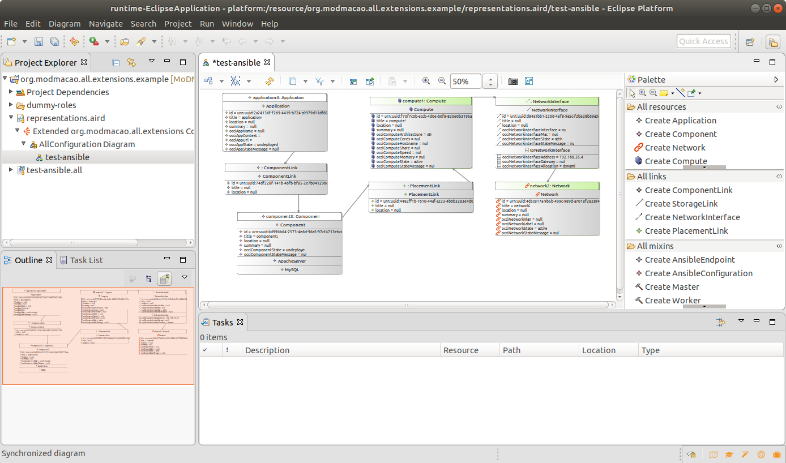
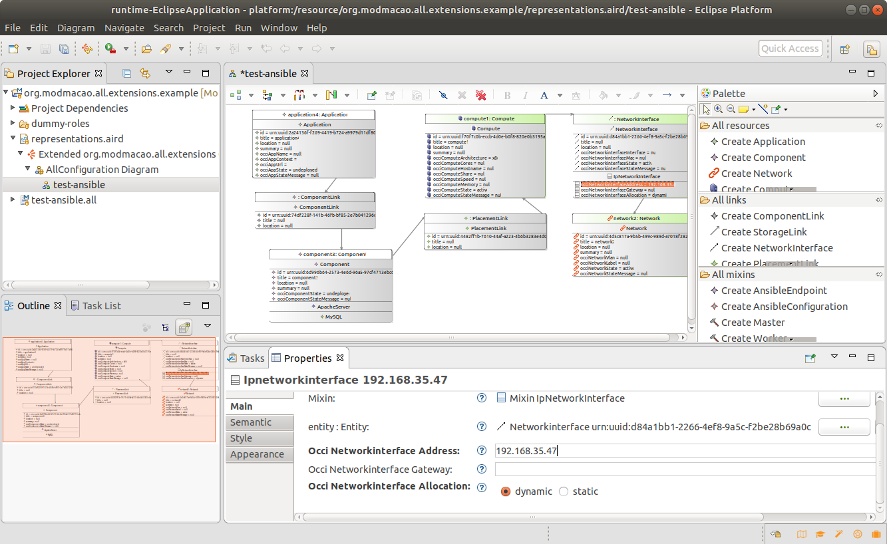
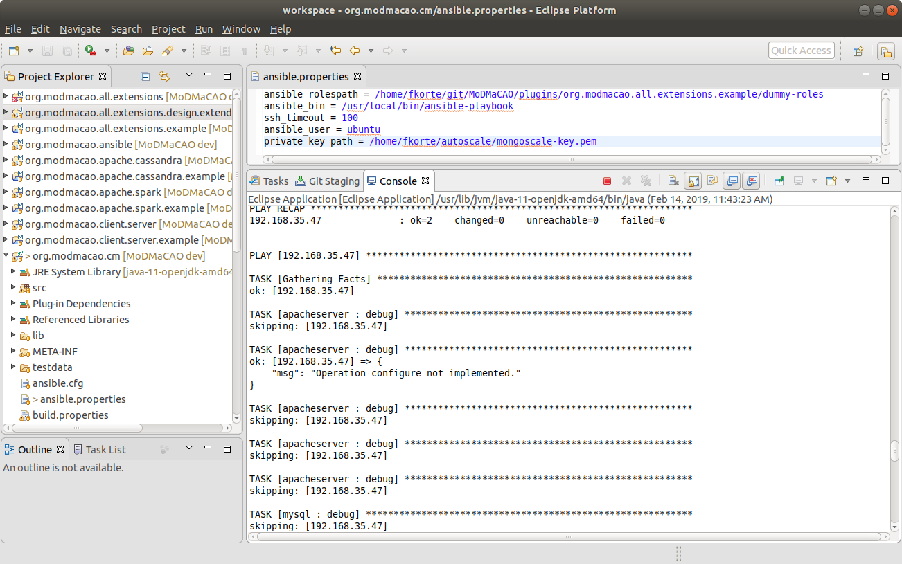
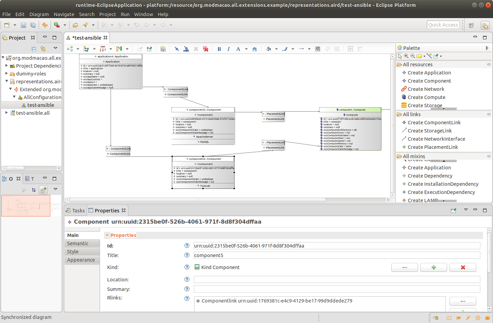
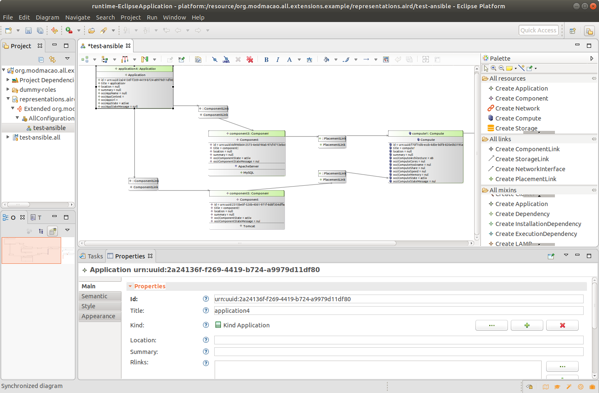

# First Steps with Ansible #

1. Open *test-ansible* in the *representation.aird* file:

  

2. Locate the NetworkInterface element and set the IP address to the address of the machine you would like to
configure (you might need to open the view *Properties* from the Menu Window->Views->Properties to be able to change
the attribute):

  

## Trigger your first action ## 
3. Now we trigger our first Ansible Action on the Application: Right Click on the Application->Deploy. 
This will run Ansible in the background to execute the roles for the Mixin *ApacheWebServer* and *MySQL* on the machine with the
configured IP address. 
Since we use the dummy roles in the tutorial, nothing will be changed on the machine, since
the corresponding tasks are not implememented. 
You can see the Ansible output in the Console view of your original workspace:

  

If you configured the ansible plugin in the correct way (with the correct key path, username, etc. ...) the state
of the Application and the connected Component will change to *deployed*.

4. Trigger the Action *Undeploy* on the Application to reset it to its original state.

## Extend the provided Configuration ##
5. Add a second Component with the Mixin Tomcat, a ComponentLink from the Application to the new Component, and
a PlacementLink from the new Component to the Compute Ressource. You will end up with a topology similar to the
one shown below:

  

6. Trigger the Actions *Deploy*, *Configure*, and *Start* on the Application. If all goes well you will end up
with a topology state similar to the one shown below:

  

Congratulations you finished your first steps with Ansible Configuration management based on MoDMaCAO.
