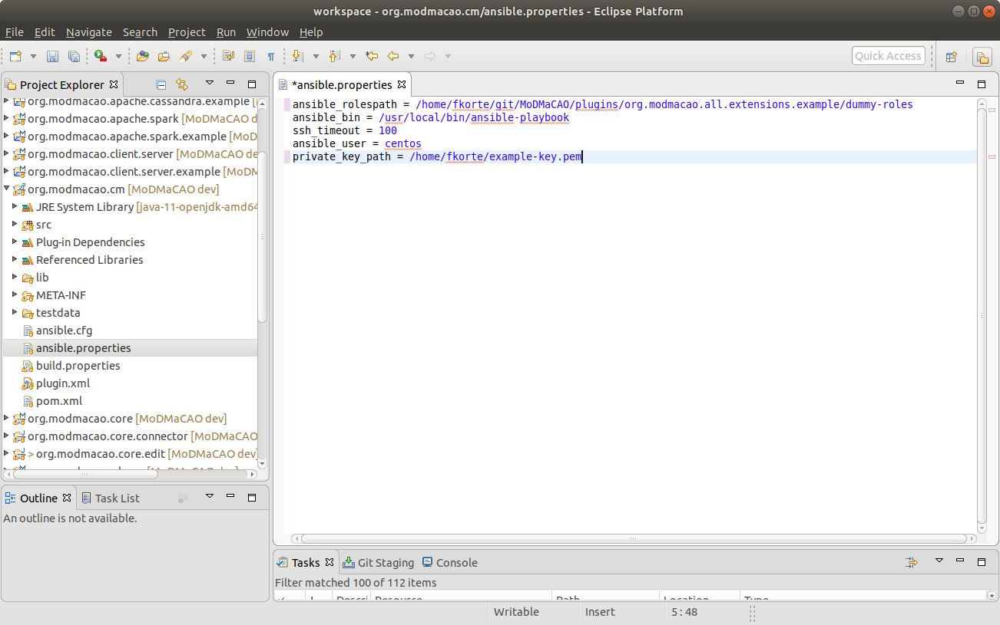

## Setup
We assume that you allready downloaded and installed OCCI-Studio.
1. Start OCCI-Studio
2. Import the projects from inside this repository in your workspace.

You should end up with an OCCI-Studio that looks similar to the one below:

  

4. Locate the project *org.modmacao.cm* and open the file *ansible.properties*:

  

You need to adjust the properties to your environment. The following properties can
be set:
- **ansible_rolespath**: The path to the location where the Ansible roles are stored on your file system. Set it
to the *dummy-roles* folder inside the project *org.modmacao.all.extensions.example* (Depends on the location where you cloned MoDMaCAO to).
- **ansible_bin**: The path to the *ansible-playbook* binary on your system. 
- **ssh_timeout**: The timeout that is used by Ansible for ssh connections.
- **ansible_user**: The user that Ansible used to connect to your hosts via ssh.
- **private_key_path**: The path on your system to the private key Ansible uses to connect to your hosts.

5. Locate the project *org.modmacao.all.extensions.design.extended*.
6. Right-Click->Run As->Run Configurations... You are now prompted to create a new run configuration for 
the project. Choose *Eclipse Application*, select Lauch with "plug-ins selected below only" and make sure
that *org.modmacao.openstack.connector* is deselected (see screenshot below):

  

7. Press Run. A new Eclipse instance will be started, configured with the plugins from your workspace. Go to its
workspace and import the project *org.modmacao.all.extensions.example* from MoDMaCAO. You should end up with a 
workspace as shown below:

  

Continue with [first steps](firststeps.md).
