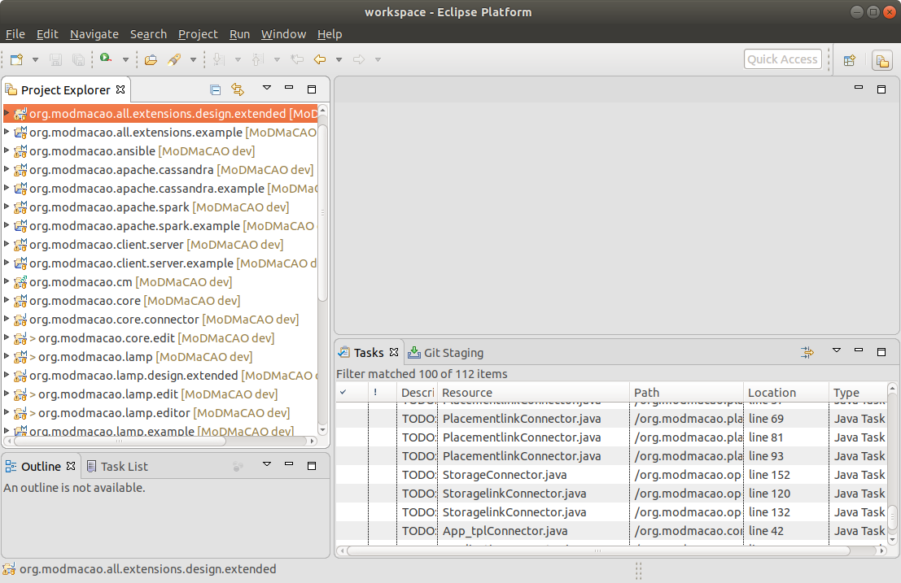
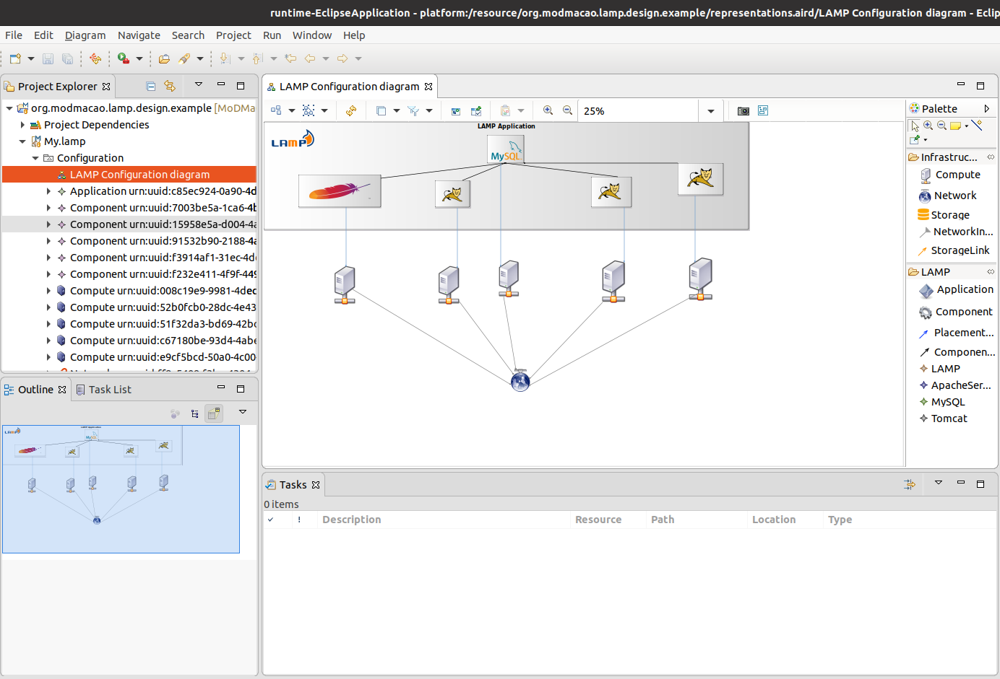

## Designer Tutorial
We assume that you already downloaded and installed OCCI-Studio.
1. Start OCCI-Studio
2. Import the projects from inside this repository in your workspace.

You should end up with an OCCI-Studio that looks similar to the one below:

  

3. Locate the project *org.modmacao.all.extensions.design.extended*.
4. Right-Click->Run As->Eclipse Application
5. A new Eclipse instance will be started, configured with the plugins from your workspace.
6. Go to the new spawned Eclipse instance and import the project *org.modmacao.lamp.design.example* from MoDMaCAO.
7. Expand the *My.lamp* file in the Project Explorer.
8. Expand the Configuration element and double-click on *LAMP Configuration diagram*. You should end up with the following view:

  

