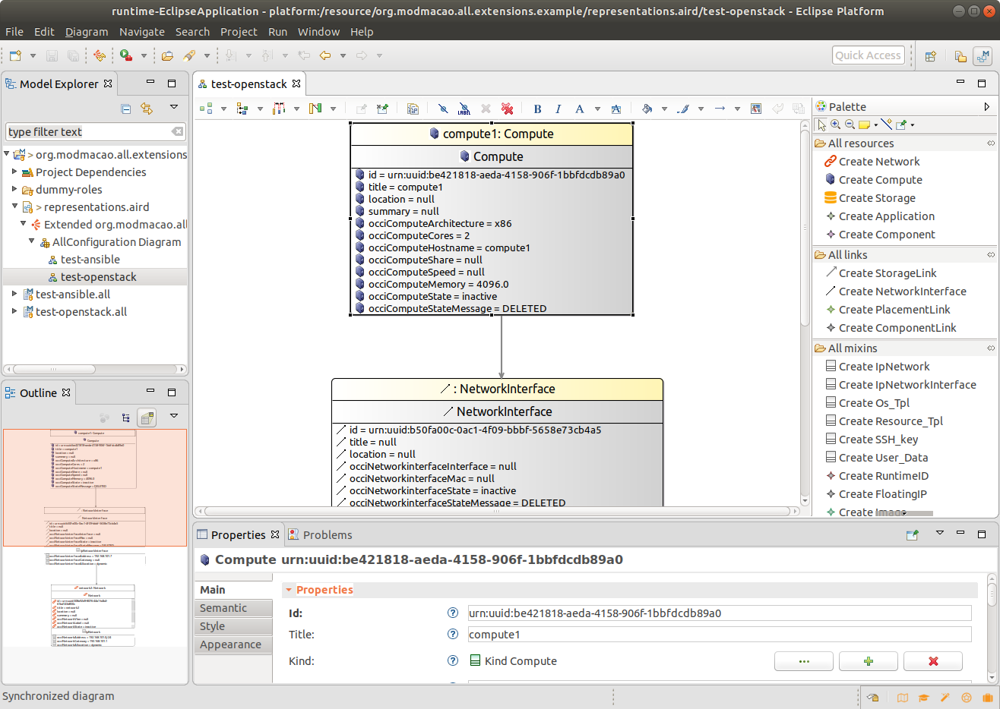
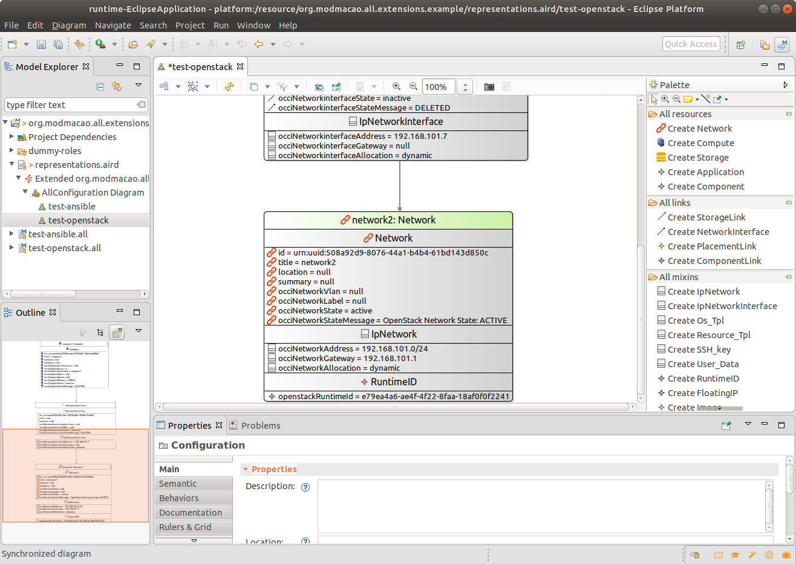
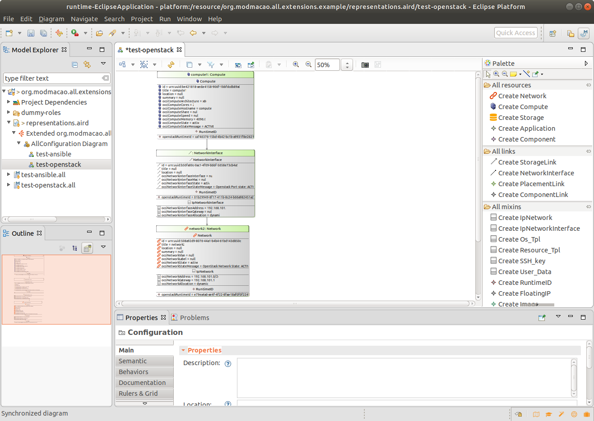

# First Steps with OpenStack in MoDMaCAO #

1. Open *test-openstack* in the *representation.aird* file:

  

The representation shows a simple setup with one virtual machine connected to a network.

2. Provision the Network: Right-Click on the Network Resource->CRUD Operations->Create
The Network will change its color to light green, when it becomes active and a new Mixin "RuntimeID"
will be added. The RuntimeID Mixin contains the OpenStack id of the running network instance.

  

3. Provision the VM: Right-Click on the Compute Resource->CRUD Operations->Create
This will provision a VM with the default flavor,image and key set in your configuration file.
The VM will change its color to light green, when it becomes active and a new Mixin "RuntimeID"
will be added. The RuntimeID Mixin contains the OpenStack id of the running VM. Note that also
the NetworkInterface will become active, since it will be created by default, when the VM gets
created

  

## Add a second VM with a specified flavor ##
tbd

## Use an allready existing ressource ##
tbd

Make sure that you call OCCI Delete (Right-Click->CRUD Operations->Delete) on all elements to deprovision the resources when you done with the tutorial.

