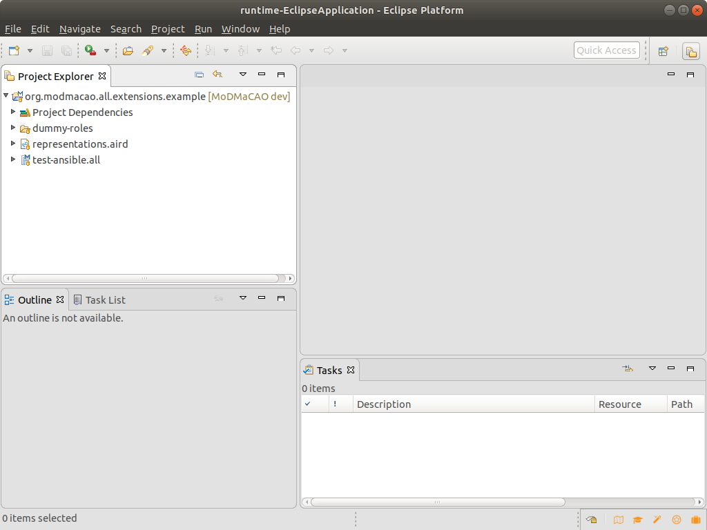

## Setup
We assume that you allready downloaded and installed OCCI-Studio.
1. Start OCCI-Studio
2. Import the projects from inside this repository in your workspace.

You should end up with an OCCI-Studio that looks similar to the one below:

  

4. Locate the project *org.modmacao.openstack.connector* and open the file *openstack.properties*:

  

You need to adjust the properties to your environment. The following properties can
be set:
- **openstack_username**: The username you use to connect to the OpenStack cloud
- **openstack_tenant**: The tenant name you use to connect to the OpenStack cloud
- **openstack_password**: The password you use to connect to the OpenStack cloud
- **openstack_endpoint**: The address of the authentification endpoint of the OpenStack cloud
- **openstack_default_network**: The ID of a network a launched VM is connected to in case no network is specified in the model
- **openstack_default_image**: The ID of a default image to use when launching a VM in case no image is specified in the model
- **openstack_default_flavor**: The ID of a default flavor to use when launching a VM in case no flavor is specified in the model
- **openstack_default_key**: A default public key, you can use to connect to the provisioned VMs

5. Locate the project *org.modmacao.all.extensions.design.extended*.
6. Right-Click->Run As->Run Configurations... Double-Click *Eclipse Application* to create a new configuration. 
7. Select Launch with "plug-ins selected below only" and make sure 
that *org.modmacao.openstack.connector* and *org.modmacao.openstack.runtime* are selected.

8. Press Run. A new Eclipse instance will be started, configured with the plugins from your workspace. Go to its
workspace and import the project *org.modmacao.all.extensions.example* from MoDMaCAO. You should end up with a 
workspace as shown below:

  

Continue with [first steps](firststeps.md).
